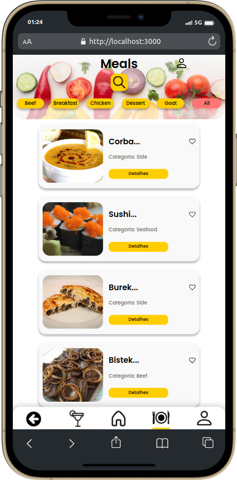
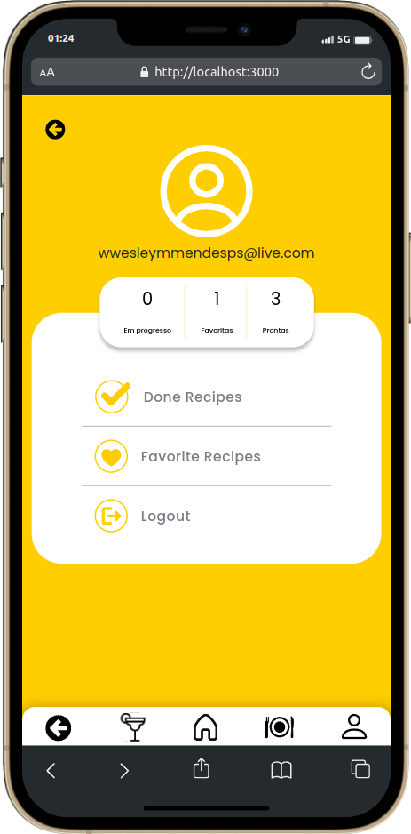

# Projeto App de Receitas! 🍴 #

Neste projeto, eu e meu grupo desenvolvemos um app de receitas utilizando o que há de mais moderno dentro do ecossistema React: Hooks e Context API. Nessa aplicação, o usuário será capaz de:

- Fazer login 🔑
- Pesquisar receitas de comidas 🍔
- Pesquisar receitas de bebidas 🍹
- Favoritar Receitas ❤️
- Acompanhar o progresso de receitas de comidas e bebidas 📈
- Verificar na página de perfil os dados da sua receita 🧑🏻‍🍳

Além disso, neste projeto, foi verificado nossa capacidade de:
- Utilizar a biblioteca React-Redux 📚
- Utilizar a Context API do React para gerenciar estado 🔄
- Utilizar o React Hook useState ⚛️
- Utilizar o React Hook useContext ⚛️
- Utilizar o React Hook useEffect ⚛️.
- Criar Hooks customizados 🪝
- Usar a metodologia Kanban para divisão de requisitos 📊

Para garantir a qualidade do código, utilizamos neste projeto os linters ESLint e StyleLint. Assim, o código se manteve alinhado com as boas práticas de desenvolvimento, além de ser mais legível e de fácil manutenção. 👨🏻‍💻

### ⚙️ Projeto funcionando ###
Você pode ver o projeto funcionando <a href=“https://recipes-app-amber.vercel.app/“>aqui</a>. Lembre-se de que se trata de um app estilizado para mobile. A estilização para desktop ainda não foi implementada.

 

 

## Requisitos 📜 ##

  
<strong>Ver Detalhes</strong>

## Tela de login
1 - Crie todos os elementos que devem respeitar os atributos descritos no protótipo para a tela de login
 
2 - Desenvolva a tela de maneira que a pessoa consiga escrever seu e-mail no input de email e sua senha no input de senha
 
3 - Desenvolva a tela de maneira que o formulário só seja válido após o preenchimento de um e-mail válido e de uma senha com mais de 6 caracteres
   
4 - Após a submissão do formulário, salve no localStorage o e-mail da pessoa usuária na chave user 
   
5 - Redirecione a pessoa usuária para a tela principal de receitas de comidas após a submissão e validação com sucesso do login
 

## Header
6 - Implemente o header de acordo com a necessidade de cada tela
 
7 - Redirecione a pessoa usuária para a tela de perfil ao clicar no botão de perfil
 
8 - Desenvolva o botão de busca que, ao ser clicado, permita a visualização da barra de busca ou a esconda
 

## Barra de busca – Header
9  - Implemente os elementos da barra de busca respeitando os atributos descritos no protótipo
 
10 - Implemente três radio buttons na barra de busca: Ingredient, Name e First letter
 
11 - Busque na API de comidas caso a pessoa esteja na página de comidas e na API de bebidas caso a pessoa esteja na de bebidas
 
12 - Redirecione a pessoa usuária para a tela de detalhes da receita caso apenas uma receita seja encontrada (o ID da receita deve constar na URL)
 
13 - Caso a busca retorne mais de uma receita, renderize as 12 primeiras encontradas e exiba a imagem e o nome de cada uma delas
 
14 - Exiba um alert caso nenhuma receita seja encontrada
 

## Menu inferior
15 - Implemente o menu inferior posicionando-o de forma fixa e contendo dois ícones: um para comidas e outro para bebidas
 
16 - Exiba o menu inferior apenas nas telas indicadas pelo protótipo
 
17 - Redirecione a pessoa usuária para a tela correta ao clicar em cada ícone no menu inferior
 

## Tela principal de receitas
18 - Carregue as 12 primeiras receitas de comidas ou bebidas, uma em cada card
 
19 - Implemente os botões de categoria para serem utilizados como filtro
 
20 - Implemente o filtro das receitas por meio da API ao clicar no filtro de categoria
 
21 - Implemente o filtro como um toggle, o qual, se for selecionado novamente, fará o app retornar as receitas sem nenhum filtro
 
22 - Redirecione a pessoa usuária para a tela de detalhes quando ela clicar no card (a rota da tela deve mudar e sua URL deve conter o ID da receita)
 

## Tela de detalhes de uma receita
23 - Realize uma request para a API passando o ID da receita que deve estar disponível nos parâmetros da URL
 
24 - Desenvolva a tela de modo que ela contenha uma imagem da receita, um título, a categoria da receita (em caso de comidas) e se é ou não alcoólica (em caso de bebidas), uma lista de ingredientes (com as quantidades e instruções necessárias), um vídeo do YouTube incorporado e recomendações
 
25 - Implemente as recomendações (para receitas de comida, a recomendação deverá ser bebida; já para as receitas de bebida, a recomendação deverá ser comida)
 
26 - Implemente os 6 cards de recomendação, mostrando apenas 2 deles (o scroll é horizontal, similar a um carousel)
 
27 - Desenvolva um botão de nome "Start Recipe", que deve ficar fixo na parte de baixo da tela o tempo todo
 
28 - Implemente a solução de forma que, caso a receita já tenha sido feita, o botão "Start Recipe" desapareça
 
29 - Implemente a solução de modo que, caso a receita tenha sido iniciada mas não finalizada, o texto do botão deve ser "Continue Recipe"
 
30 - Redirecione a pessoa usuária caso o botão Start Recipe seja clicado (nesse caso, a rota deve mudar para a tela de receita em progresso)
 
31 - Implemente um botão de compartilhar e um de favoritar a receita
 
32 - Implemente a solução de forma que, ao clicar no botão de compartilhar, o link de detalhes da receita seja copiado para o clipboard e uma mensagem avisando que ele foi copiado apareça na tela em uma tag HTML
 
33 - Salve as receitas favoritas no localStorage na chave favoriteRecipes
 
34 - Implemente o ícone do coração (favorito) de modo que ele fique preenchido caso a receita esteja favoritada e vazio caso contrário
 
35 - Implemente a lógica no botão de favoritar de modo que, caso ele seja clicado, o ícone de coração mude seu estado atual e, caso esteja preenchido, mude para vazio e vice-versa
 

## Tela de receita em progresso
36 - Desenvolva a tela de modo que ela contenha uma imagem da receita, um título, a categoria (em caso de comidas) e se é ou não alcoólico (em caso de bebidas), uma lista de ingredientes (com as quantidades e instruções necessárias)
 
37 - Desenvolva um checkbox para cada item da lista de ingredientes
 
38 - Implemente uma lógica que ao clicar no checkbox de um ingrediente, o nome dele deve ser "riscado" da lista
 
39 - Salve o estado do progresso, que deve ser mantido caso a pessoa atualize a página ou volte para a mesma receita
 
40 - Desenvolva a lógica de favoritar e compartilhar (a lógica da tela de detalhes de uma receita se aplica aqui)
 
41 - Implemente a solução de modo que o botão de finalizar receita (Finish Recipe) só esteja habilitado quando todos os ingredientes estiverem "checkados" (marcados)
 
42 - Redirecione a pessoa usuária após ela clicar no botão de finalizar receita (Finish Recipe) para a página de receitas feitas, cuja rota deve ser /done-recipes
 

## Tela de receitas feitas
43 - Implemente os elementos da tela de receitas feitas respeitando os atributos descritos no protótipo
 
44 - Desenvolva a tela de modo que, caso a receita do card seja uma comida, ela apresente: foto da receita, nome, categoria, nacionalidade, data em que a pessoa fez a receita, duas primeiras tags retornadas pela API e botão de compartilhar
 
45 - Desenvolva a tela de maneira que, caso a receita do card seja uma bebida, ela apresente: foto da receita, nome, se é alcoólica, data em que a pessoa fez a receita e botão de compartilhar
 
46 - Desenvolva a solução de modo que o botão de compartilhar copie a URL da tela de detalhes da receita para o clipboard
 
47 - Implemente 2 botões que filtram as receitas por comida ou bebida e um terceiro que remove todos os filtros
 
48 - Redirecione a pessoa usuária para a tela de detalhes da receita caso seja clicado na foto ou no nome da receita
 

## Tela de receitas favoritas
49 - Implemente os elementos da tela de receitas favoritas (cumulativo com os atributos em comum com a tela de receitas feitas) respeitando os atributos descritos no protótipo
 
50 - Desenvolva a tela de modo que, caso a receita do card seja uma comida, ela apresente: foto da receita, nome, categoria, nacionalidade, botão de compartilhar e botão de desfavoritar
 
51 - Desenvolva a tela de modo que, caso a receita do card seja uma bebida, ela apresente: foto da receita, nome, se é alcoólica ou não, botão de compartilhar e botão de desfavoritar
 
52 - Desenvolva a solução de modo que o botão de compartilhar copie a URL da tela de detalhes da receita para o clipboard
 
53 - Desenvolva a solução de modo que o botão de desfavoritar remova a receita da lista de receitas favoritas do localStorage e da tela
 
54 - Implemente dois botões que filtrem as receitas por comida ou bebida e um terceiro que remova todos os filtros
 
55 - Redirecione a pessoa usuária quando ela clicar na foto ou no nome da receita (nesse caso, a rota deve mudar para a tela de detalhes daquela receita)
 

## Tela de perfil
56 - Implemente os elementos da tela de perfil respeitando os atributos descritos no protótipo
 
57 - Implemente a solução de maneira que o e-mail da pessoa usuária esteja visível
 
58 - Implemente três botões: um de nome Done Recipes, um de nome Favorite Recipes e um de nome Logout
 
59 - Redirecione a pessoa usuária de modo que, ao clicar no botão de Done Recipes, a rota mude para a tela de receitas feitas
 
60 - Redirecione a pessoa usuária de modo que, ao clicar no botão de Favorite Recipes, a rota mude para a tela de receitas favoritas
 
61 - Redirecione a pessoa usuária de modo que, ao clicar no botão Logout, o localStorage seja limpo e a rota mude para a tela de login
 

 

### Além disso, toda a aplicação foi posteriormente estilizada com CSS Modules garantindo um layout agradável e responsivo. ###

### O que já veio pronto da Trybe ###
- Todos os testes de requisitos que foram rodados no Cypress durante o desenvolvimento já vieram prontos da Trybe.
- Toda a estruturação do README com os requistos e o quadro do Trello vieram prontos.

### Agradecimento à denisrodrigues-dev pela colaboração em todo o projeto

### 📬 Entre em contato comigo ###
Em caso de dúvidas ou para entrar em contato, você pode me encontrar em:

- ✉️ Email: wesleymendes123321@gmail.com
- 🔗 Linkedin: https://www.linkedin.com/in/wesley-mendes/
